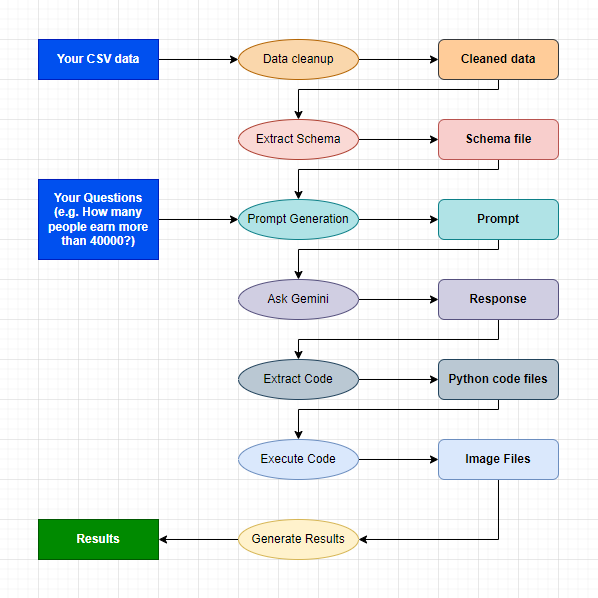

# Simple insight generation tool using GenAI

> Caution: This is a hobby project! The code is poorly rewritten.

Powered by Google's Gemini 1.5 Flash.

## What?

This tool simply helps you ask questions and generate surface-level insights or draw graphs and charts on the CSV data provided by you.

## Screenshots

## Setup

1. Get a Google AI account with access to Gemini from Google AI Studio. Populate the `.env.example` file the Gemini API Key and rename it `.env`.
2. Create virtual environment and install dependencies.
3. Run project with `python web.py`.
4. (Optional) If you want command line script then run `python app.py` after filling the `DATA_PATH` and `questions` variables in `app.py`.

## Working

## Gemini Prompt

[Prompt Link](https://aistudio.google.com/app/prompts?state=%7B%22ids%22:%5B%221o6OrTgA7VzKNevyk81UZZaRxz-IYQM_-%22%5D,%22action%22:%22open%22,%22userId%22:%22109122240227568426747%22,%22resourceKeys%22:%7B%7D%7D&usp=sharing)

## License

MIT
